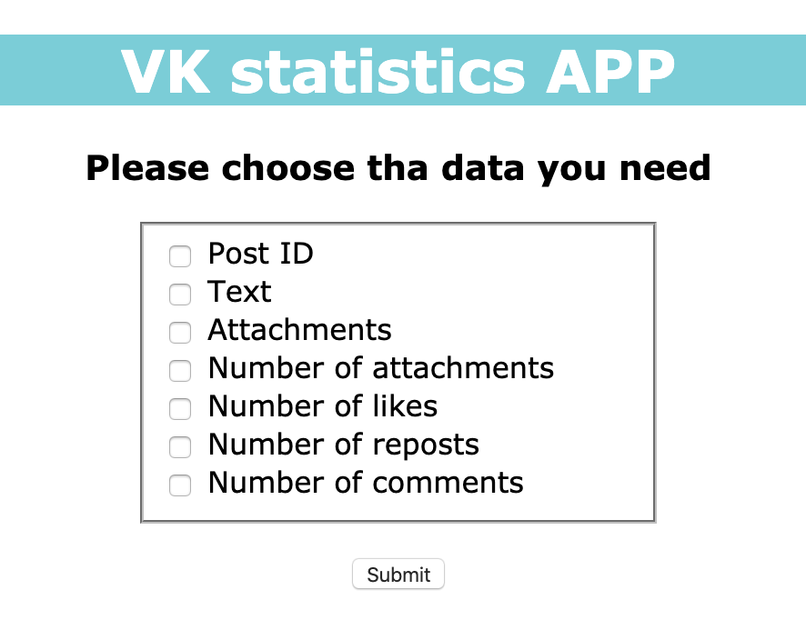
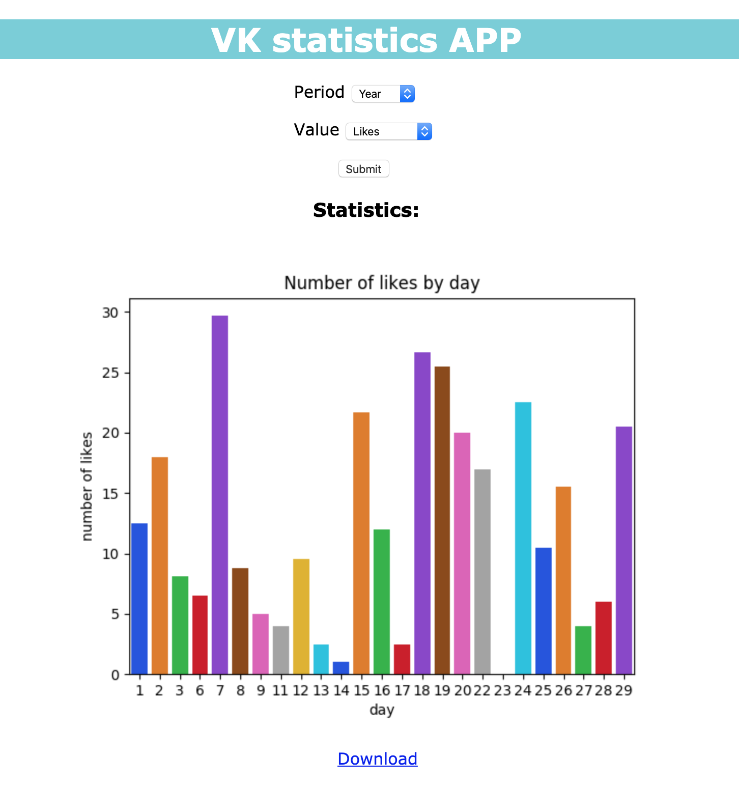

# VK statictic APP

This is a web application that allows you to receive data and statistics about posts on the wall of user or community from the Vkontakte (vk.com).

## Getting Started

```
git clone https://github.com/xredian/vk_post_statistic.git
```

### Prerequisites

First of all, install the following using -pip

```
pip install -r requirements.txt
```

### Installing

Create .env as an example:

```
ACCESS_TOKEN = '1234abcd'
API_VERSION = '5.52'
```

Run app.py:

```
python3 app.py
```

## Usage
On page "User ID and date" input id of user or community and date, started from which data is taken.


On page "Choose" push one of the buttons to download statistics or display it on graphs.


If *Download button* has been pressed then the page "Checkbox" will be open.
On this page choose all necessary items.



After clicking *submit button* data will be downloaded.

If *Graphic button* has been pressed then the page "Graphic" will be open.


Here you can select the period for which data needed, and the necessary values.

After clicking *submit button* data will be displayed. Also there will be a *Download button* which allows to download the graphic.



## Authors

* **Uliana Diakova** - *Examination project* - [xredian](https://github.com/xredian)
